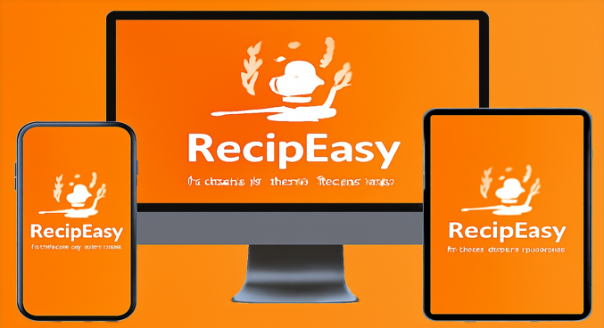
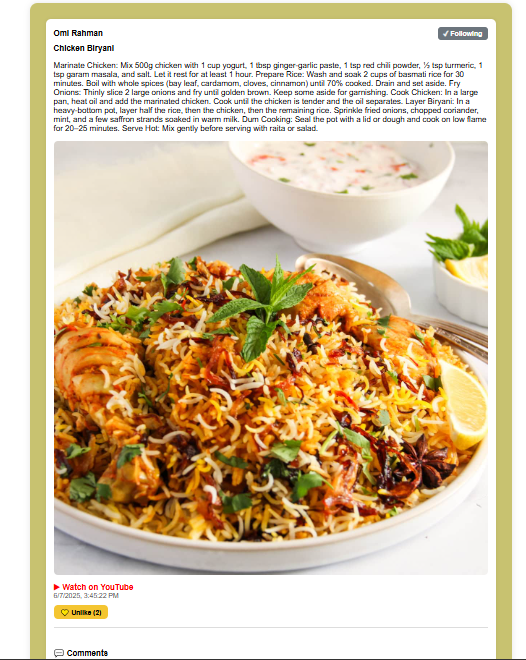
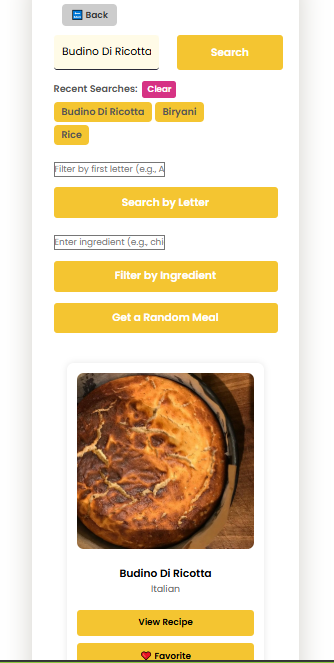
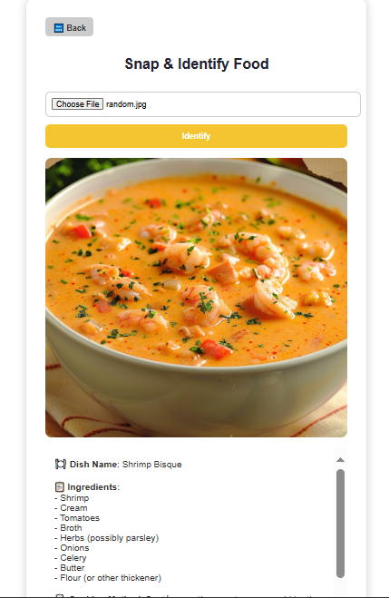

# 🍳 RecipEasy — A Social Recipe Finder App

**RecipEasy** is a cross-platform recipe discovery and sharing app that blends social networking with cooking inspiration. Users can search, post, and engage with recipes, while admins moderate content and track analytics.

---

## 📌 Overview
Manual recipe management via web search or physical records is inefficient and fragmented.  
RecipEasy consolidates:
- Recipe discovery
- Community interaction
- Content creation & analytics
- Administrative moderation tools

It works on **modern web browsers**, **Android devices**, and **desktop platforms**, supporting both **online** and **offline** usage.

## 📷 Screenshots

Here are some screenshots of the RecipEasy app (only for the webapp version):

<p align="center">
  
  
  
  
</p>
---

---

## ✨ Features
- **User Authentication & Profiles**
  - Sign up, log in, upload profile pictures
  - Role-based access (User / Admin)
- **Recipe Search**
  - Search by recipe name, first letter, or ingredient
  - Powered by [TheMealDB API](https://www.themealdb.com)
- **Recipe Management**
  - Save favorite recipes
  - Maintain search history
- **Content Creation**
  - Post recipes with images, videos, YouTube links
  - Edit, delete, and view analytics
- **Social Interaction**
  - Like, share, comment
  - Follow/unfollow users
- **Messaging**
  - Direct user-to-user chat
  - Offline & online chatbot support
- **Personalized Feed**
  - Approved posts from followed users
- **Admin Panel**
  - Approve/reject posts
  - View rejected items
  - Access analytics
- **Analytics**
  - Charts and stats for engagement, likes, and posting frequency
- **Offline Support**
  - LocalStorage & Firebase fallback

---

## 🛠 Tech Stack
- **Frontend:** HTML, CSS, JavaScript
- **Mobile:** Java (Android Studio)
- **Desktop:** Electron
- **Backend:** Firebase, LocalStorage, MySQL
- **API:** [TheMealDB](https://www.themealdb.com)

---

## 👥 User Classes
- **Regular Users**
  - Search, save, and share recipes
  - Post content and interact socially
- **Admins**
  - Moderate posts
  - Access analytics
- **Guest Users** *(future enhancement)*
  - View public recipes without login

---

## 💻 Operating Environment
- **Operating Systems:** Windows 7/8/10/11, macOS, Linux, Android 8+
- **Browsers:** Chrome, Firefox, Edge

---

## 🚀 Installation & Setup

### Web Version
1. **Clone the repository**
   ```bash
   git clone https://github.com/Prithvi1101/RecipEasy-A-Social-Recipe-Finder-App.git
   cd RecipEasy/web
## 💻 Install dependencies
- **Install Node.js
- **Run
  ```bash
  npm install
  
## Configure Firebase
1. Create a project in [Firebase Console](https://console.firebase.google.com/).  
2. Enable the following services:
   - Authentication
   - Firestore
   - Storage

## Add Firebase Config
- Add your Firebase configuration to `firebaseConfig.js`.

## Run the App
```bash
npm run dev
```
### 🔹 Android Version
1. **Clone the repository**
   ```bash
   git clone https://github.com/Prithvi1101/RecipEasy-A-Social-Recipe-Finder-App.git
   ```
   Open in Android Studio

Navigate to the android/ folder and open the project

Configure Firebase

Download google-services.json from Firebase Console

Place it inside the app/ directory

Build & Run

Use an emulator or a physical device

Press Run ▶ in Android Studio

## 🔹 Desktop Version (Electron)

### Clone the repository
```bash
git clone https://github.com/Prithvi1101/RecipEasy-A-Social-Recipe-Finder-App.git


npm install
```
Configure Firebase
Add your Firebase config to src/firebaseConfig.js
```
npm start
npm run build
```

Made this for my Software Engineering and Requirements course and got the best project amongst 30+ other projects

